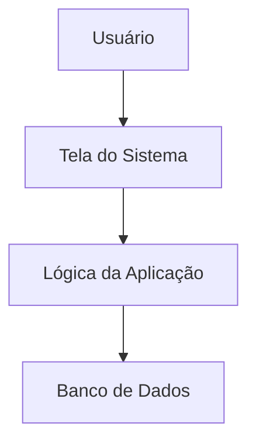
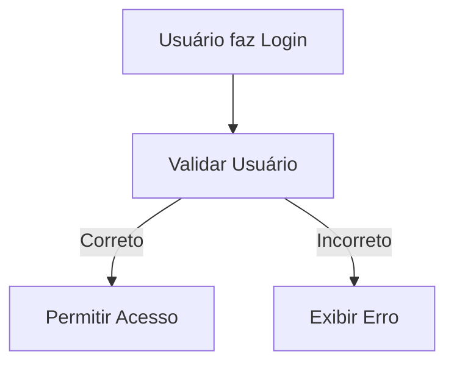
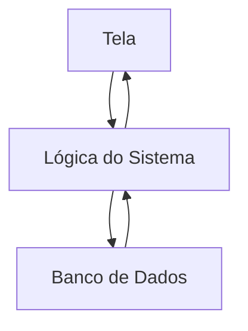
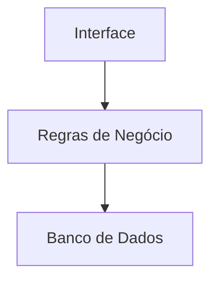
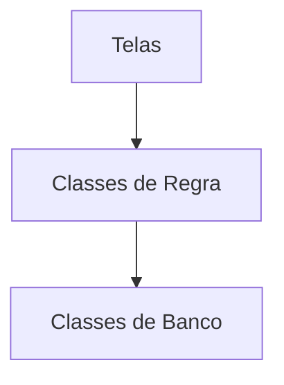
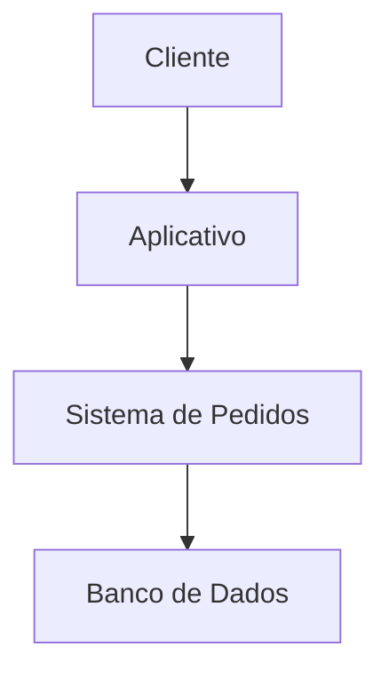
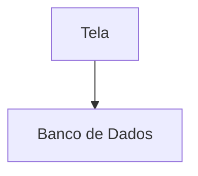
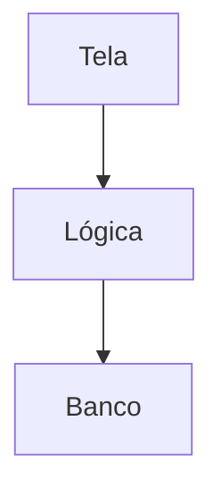

# Arquitetura de Sistemas

> Disciplina: Modelagem de Software e Arquitetura de Sistemas

---

# O que é Arquitetura de Sistemas?

Arquitetura de sistemas representa a forma como um software é organizado.

Ela define:

- como as partes do sistema se conectam;
- como as responsabilidades são separadas;
- como o sistema funciona de forma estruturada.

---

# Pensando de Forma Simples

A arquitetura funciona como a planta de uma casa.

Antes de construir, precisamos planejar:

- organização;
- divisão de responsabilidades;
- comunicação entre partes;
- estrutura geral.

No software acontece algo parecido.

---

# Estrutura Básica de um Sistema

---

# Interface do Usuário

A interface é a parte visual do sistema.

Exemplos:

- telas;
- botões;
- formulários;
- menus.

Tecnologias comuns:

- HTML;
- CSS;
- Java Swing;
- JavaFX;
- React;
- Vue.

---

# Exemplo de Interface

---

# Lógica da Aplicação

A lógica da aplicação contém as regras do sistema.

Exemplos:

- validar login;
- calcular valores;
- verificar estoque;
- salvar informações.

---

# Exemplo de Fluxo

---

# Banco de Dados

O banco de dados armazena as informações do sistema.

Exemplos:

- usuários;
- produtos;
- pedidos;
- mensagens.

Tecnologias comuns:

- SQLite;
- MySQL;
- PostgreSQL.

---

# Comunicação com Banco

---

# Arquitetura em Camadas

Um modelo muito comum é a arquitetura em camadas.

Cada camada possui uma responsabilidade específica.

---

# Separação de Responsabilidades

Separar responsabilidades ajuda a:

- organizar o projeto;
- facilitar manutenção;
- reduzir erros;
- melhorar o trabalho em equipe.

---

# Exemplo de Organização

---

# Front-end e Back-end

## Front-end

Parte visual do sistema.

## Back-end

Parte responsável pelo processamento e regras.

---

# Exemplo Simplificado

---

# APIs

Muitos sistemas modernos utilizam APIs para comunicação.

API é uma ponte entre sistemas.

---

# Exemplo de API

---

# Exemplo do Cotidiano

## Aplicativo de Delivery

---

# Importância da Arquitetura

Uma boa arquitetura ajuda a:

- melhorar organização;
- facilitar manutenção;
- permitir crescimento do sistema;
- reduzir problemas futuros.

---

# Erros Comuns

## Misturar responsabilidades

Exemplo ruim:

A interface acessando diretamente o banco pode dificultar manutenção.

---

# Modelo Mais Organizado

---

# Resumo

- Arquitetura organiza o sistema;
- Sistemas possuem partes com responsabilidades diferentes;
- A separação melhora manutenção e organização;
- Arquitetura em camadas é muito utilizada;
- Diagramas ajudam a visualizar o funcionamento do sistema.
