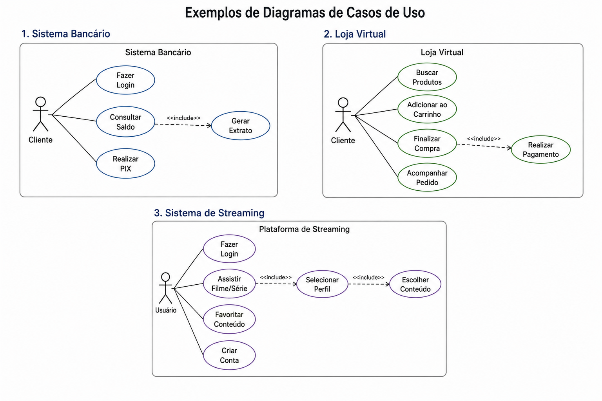

# Aula 8 - 08/05/2026

# Casos de Uso

> Disciplina: Modelagem de Software e Arquitetura de Sistemas

---

# Objetivos

- Entender o que são casos de uso;
- Identificar atores de um sistema;
- Compreender a relação entre usuário e funcionalidades;
- Interpretar diagramas básicos de casos de uso.

---

# O que são Casos de Uso?

Casos de uso representam funcionalidades do sistema do ponto de vista do usuário.

Em outras palavras:

> mostram o que o usuário consegue fazer usando o sistema.

---

# Exemplos

## Sistema Bancário

- Fazer login
- Consultar saldo
- Realizar PIX

## Loja Virtual

- Comprar produto
- Adicionar ao carrinho
- Acompanhar pedido

## Streaming

- Assistir filme
- Criar conta
- Favoritar conteúdo

---

---

# Atores

Atores representam quem interage com o sistema.

Podem ser:

- pessoas;
- outros sistemas;
- dispositivos.

---

# Exemplos de Atores

| Sistema | Atores |
|---|---|
| Loja Virtual | Cliente, Administrador |
| Banco | Cliente, Gerente |
| Delivery | Cliente, Restaurante, Entregador |

---

# Relação entre Ator e Caso de Uso

O ator utiliza funcionalidades do sistema.

Exemplo:

~~~text
Cliente → Fazer Login
Cliente → Comprar Produto
Administrador → Gerenciar Produtos
~~~

---

# Diagramas de Casos de Uso

Os diagramas de casos de uso fazem parte da UML.

Eles ajudam a representar:

- atores;
- funcionalidades;
- interações do sistema.

---

# Exemplo Simplificado

~~~text
        [Cliente]
            |
   -------------------
   |        |        |
(Login) (Comprar) (Pedido)
~~~

---

# Descrição Textual

Um caso de uso também pode ser descrito em texto.

## Exemplo: Fazer Login

| Campo | Descrição |
|---|---|
| Ator | Usuário |
| Objetivo | Entrar no sistema |
| Entrada | E-mail e senha |
| Saída | Usuário autenticado |

---

# Erros Comuns

## Confundir telas com funcionalidades

Errado:

- Tela Inicial
- Página Home

---

## Usar termos técnicos demais

Errado:

- Executar SQL
- Validar Token

Casos de uso devem focar no usuário.

---

# Importância

Casos de uso ajudam a:

- entender requisitos;
- organizar funcionalidades;
- melhorar comunicação da equipe;
- planejar o sistema.

---

# Exercício

Escolha um sistema do cotidiano e identifique:

- 2 atores;
- 5 casos de uso.

Exemplos:

- Netflix
- WhatsApp
- YouTube
- iFood
- Aplicativo Bancário

---

# Resumo Casos de Uso

- Casos de uso representam funcionalidades;
- Atores representam quem usa o sistema;
- Diagramas ajudam na visualização;
- Casos de uso auxiliam na modelagem do software.

